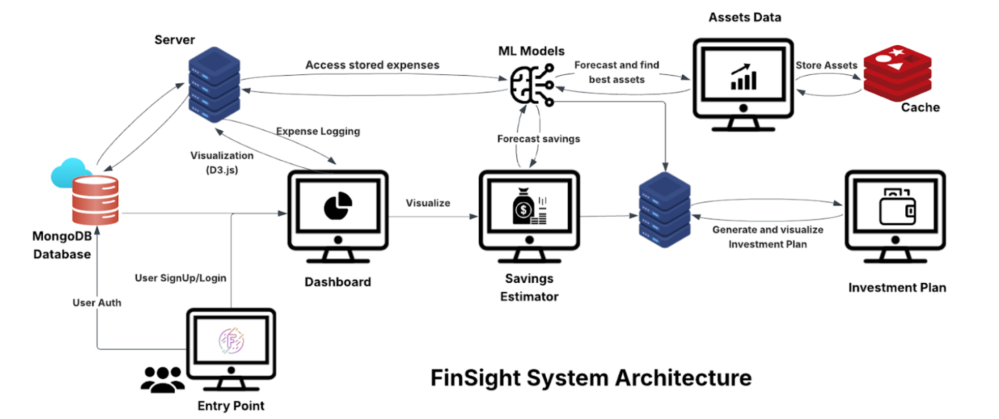
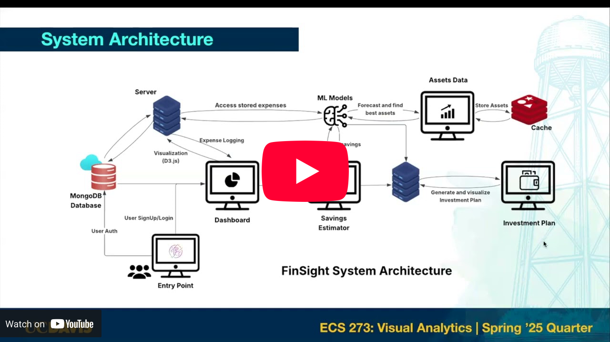
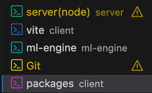
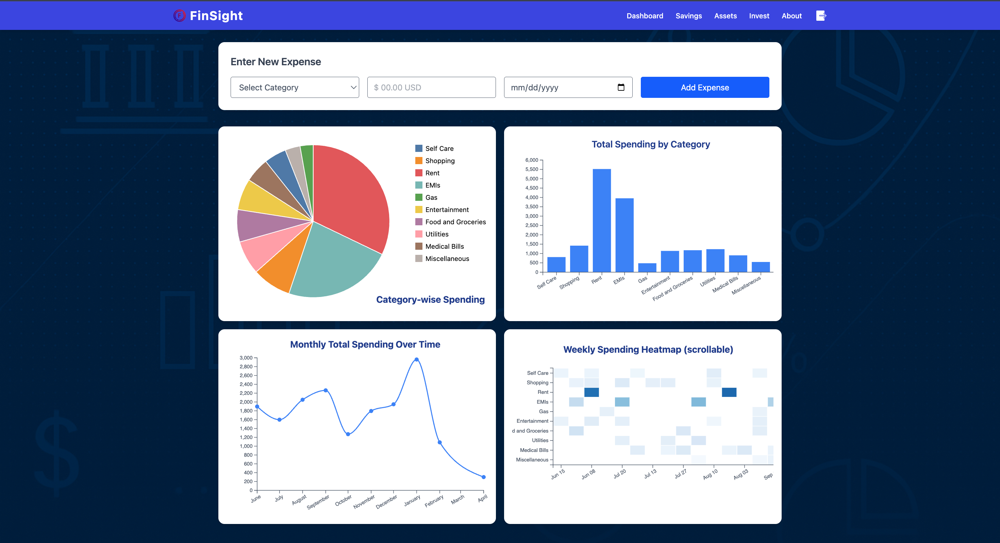
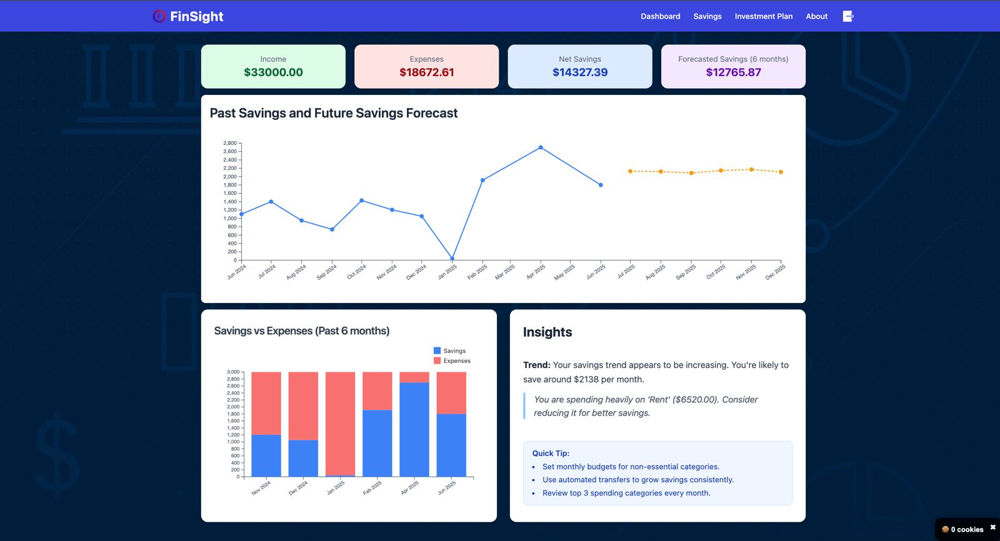
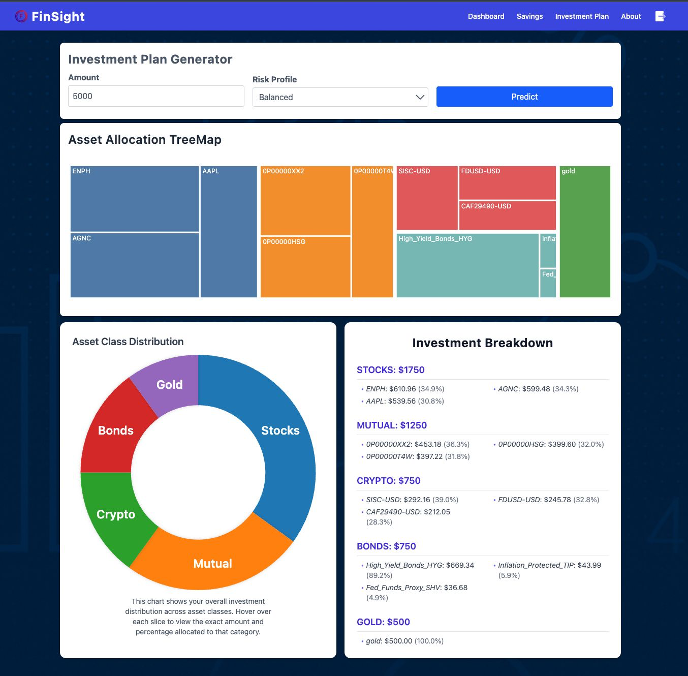
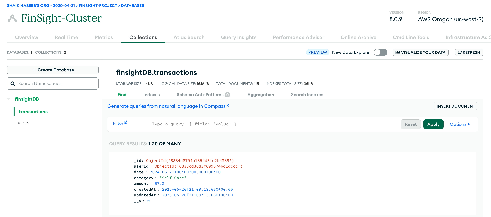

# FinSight

A Smart Visual Analytics Platform for Personal Finance Tracking &amp; Goal-Oriented Investment Planning

## Description

FinSight is an intelligent personal finance platform that helps users track expenses, analyze spending habits, and visualize financial trends through intuitive and interactive dashboards. Beyond expense tracking, it leverages machine learning and real-time asset data to forecast savings and generate personalized investment plans. By incorporating user risk profiles and market performance, FinSight delivers dynamic, monthly asset allocations across stocks, mutual funds, bonds, crypto, and gold, empowering users to make informed decisions and achieve long-term financial goals with confidence.

## FinSight Architecture


## Application Setup

> Follow along this youtube video to install the application:
[FinSight Installation | YouTube](https://youtu.be/Dke-BLTgQ0I)

### [0] Project Walkthrough
[](https://www.youtube.com/watch?v=Xxr4JD4Qgj4)

### [1] Clone the repository
```shell
git clone https://github.com/haseebshaik00/FinSight.git
```

### [2] Environment Setup
- Navigate to the root folder: `FinSight/`
- This folder contains three folders: client, server and ml-engine
- Setup up your enviroment using miniconda (optional)

```shell
conda create -n finsight python=3.12
conda activate finsight
```

### [3] Node Server Setup
- Navigate to the folder `./FinSight/server`
- Create a .env file in the server folder and place the below content in it:
```shell
MONGO_URI=myjwtsecret
JWT_SECRET=myjwtsecret
```
- Install the required packages and boot the server
```shell
npm install
npm run dev
```

### [4] Fast API Server Setup
- Navigate to the folder `./FinSight/ml-engine`
- Install the required packages
```shell
pip install -r requirements.txt
```
- Finally, start your Fast API server:
```shell
uvicorn api:app --reload --port 8000
```

### [5] Client Setup

- Navigate to the folder `./FinSight/client`
- Install the required packages and start the client
```shell
npm install
npm run dev
```
- Browse `http://localhost:5173/`

### [6] User Login
- Browse `http://localhost:5173/`
- Click on Sign in
```shell
User Credentials
email: test@test.com
password: test123
```

### [7] User Sign Up
- Browse `http://localhost:5173/`
- Create new account! (If login doesn't work)

## Server Handling
> An efficient way to handle all the servers (client, backend, ml-engine)!



## Folder Structure

```bash
FinSight/
├──ml-engine
├──client
└──server

ml-engine/
1-train_attention_lstm.ipynb: trains an Attention-based LSTM model, and saves it as `trained-attention-lstm.pth`
2-attention-based-lstm-model.ipynb: Allocation script
3-allocation.py: python script of train_attention_lstm notebook
4-api.py: Fast API
5-data/: contains scraping notebooks and scraped assets data (historical and market)

server/
.env: this has to be created manually
src/: Server side(authentication, REST API, DB query) logic

client/src/
pages/: contains wireframes
components/: contains visualization components, navbar and container
App.jsx: main file
```

## Application Walkthrough

### [1] Expense Dashboard



### [2] Savings and Forecasted Savings Dashboard


### [3] Investment Plan Dashboard


### [4] MongoDB Database


<br/>

<hr>

> 📘 **Disclaimer:**  
FinSight is intended solely for academic and study purposes. The content is shared publicly to promote open knowledge and may be reused, referenced, or extended by others, provided that appropriate credit is given. Contributions, feedback, and collaborations are welcome.
